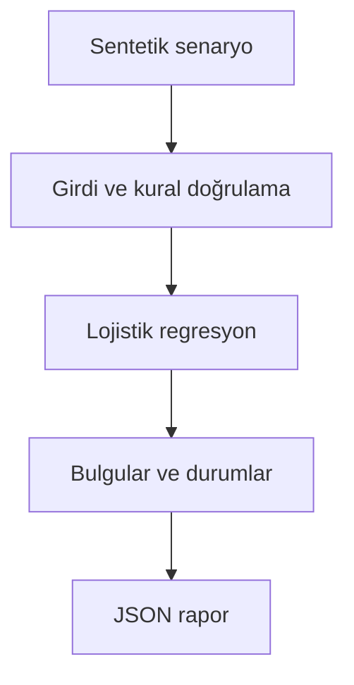

# Mimari

Henüz bilinmeyen gelecek etiketlerinin eğitim setine sızmasını engelleyerek risk skorlamak.

Asıl alan akışı: **Historical cutoff → train-only scaling → regularized gradient descent → future evaluation**. CLI JSON yükler, çekirdek `run(config)` alan motorunu çağırır ve JSON seri hale getirir. Veritabanı kullanan örnekler geçici dizinde izole edilir; kalıcı sınıflar doğrudan çağrılırken dosya yolu dışarıdan verilir.

## İnvariant ve başarısızlık sınırı

Etiket zamanı cutoff öncesinde olmalıdır; holdout gözlem zamanı cutoff sonrasındadır.

Sentetik veri ve basit modeldir; gerçek müşteride grup ayrımı, kalibrasyon ve model yönetişimi gerekir.

Her hata kararı makine tarafından okunabilir çıktı veya açık exception üretir. Geçersiz yapılandırma sessizce düzeltilmez. Olası tekrarların güvenliği ilgili çekirdeğin kabul kurallarına bağlıdır; bütün projelere ortak bir retry uygulanmaz.
